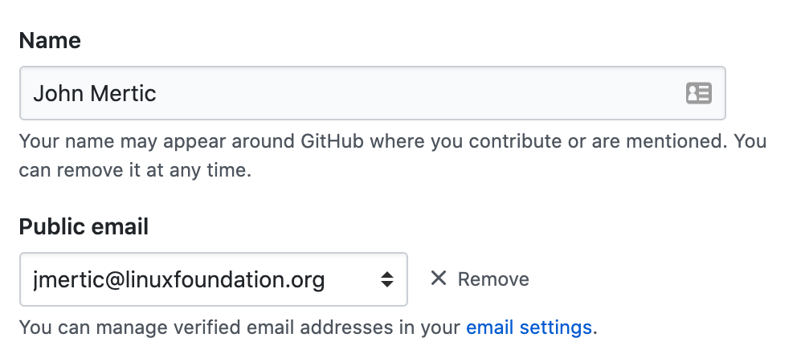

# Contribution Guidelines for hosted projects

- [Two-factor authentication (2FA)](#two-factor-authentication-2fa)
- [License specification](#license-specification)
- [Developer Certificate of Origin](#developer-certificate-of-origin)
    - [Useful tools to make doing DCO signoffs easier](#useful-tools-to-make-doing-dco-signoffs-easier)
    - [Signoff for commits where the DCO signoff was missed](#signoff-for-commits-where-the-dco-signoff-was-missed)
    - [Handling DCO errors using GitHub website commits](#handling-dco-errors-using-github-website-commits)


This document captures the general guidelines for contributing to open-source projects hosted by Open Mainframe Project. These guidelines express the provisions in the Intellectual Property Policy within [Open Mainframe Project charter](https://openmainframeproject.org/charter).

Note that each hosted project may adopt its guidelines, which would supersede these provisions in the case of conflict.

## Two-factor authentication (2FA)

To enable more robust security for hosted projects, Open Mainframe Project TAC requires all hosted projects to require Two-factor authentication (2FA) for accessing code repositories. Instructions for GitHub are below...

- [Configuring 2FA for your GitHub account](https://docs.github.com/en/github/authenticating-to-github/configuring-two-factor-authentication)
- [Accessing GitHub using 2FA](https://docs.github.com/en/github/authenticating-to-github/accessing-github-using-two-factor-authentication)
- [Recovering your account if you lose your 2FA credentials](https://docs.github.com/en/github/authenticating-to-github/recovering-your-account-if-you-lose-your-2fa-credentials)

## License specification

All source code must clearly identify the open-source license used. The Open Mainframe Project charter dictates [Apache 2](https://spdx.org/licenses/Apache-2.0.html) by default, except for Linux kernel code which must be [GPLv2](https://spdx.org/licenses/GPL-2.0) unless a specific project charter's intellectual property policy states otherwise. The Project will receive and make all documentation and other non-code assets available under the Creative Commons Attribution 4.0 International License (available at http://creativecommons.org/licenses/by/4.0/).

Requirements to ensure license compliance

- Each repository must contain a license file. Include the plain-text version of the license as a LICENSE file in the top-level directory of the repository.
- All source files need to include a header to clearly show the license. Open Mainframe Project has standardized on including [SPDX short-form license identifiers](https://spdx.org/ids) and a general copyright statement as shown below ( this example is for Apache 2.0 licensed code ):

````
/**
  Copyright Contributors to the [NAME OF PROJECT] Project.

  SPDX-License-Identifier: Apache-2.0
**/
````

The license may be omitted for property or configuration files that do not support comments. If comments are supported, the license header should be included.

Contributors may include a copyright statement specifying themselves or their employer (as applicable) as the copyright holder of their contributions, but the Open Mainframe Project does not require or recommend this.

Finally, please note that pre-existing third-party license notices and copyright notices *should not be modified or removed* by anyone other than the copyright holder. Any questions on including code under a different license than the project should be discussed with the project lead and Open Mainframe Project Governing Board.

## Developer Certificate of Origin

Open Mainframe Project requires the Developer’s Certificate of Origin 1.1 (DCO), the same mechanism the [Linux® Kernel](https://git.kernel.org/pub/scm/linux/kernel/git/torvalds/linux.git/tree/Documentation/process/submitting-patches.rst#n416) and many other communities use to manage code contributions. The DCO is considered one of the simplest tools for sign-offs from contributors as the representations are meant to be easy to read and indicate signoff is done as a part of the commit message.

Here is an example Signed-off-by line, which indicates that the submitter accepts the DCO:

<code>Signed-off-by: John Doe <john.doe@hisdomain.com></code>

You can include this automatically when you commit a change to your local git repository using <code>git commit -s</code>.

Additionally, it is possible to use shell scripting to apply signoff automatically. Here is an example for bash to be put into a .bashrc file:

```
git() {
    if [[ $1 == "commit" ]]; then
        shift
        echo "Executing git commit -s $@"
        command git commit -s "$@"
    else
        command git "$@"
    fi
}
```

### Signoff for commits where the DCO signoff was missed

When bringing in a code repository for the first time or commits done before the DCO checks are enabled, there would be a series of commits that don't include the sign-off statement. You can retroactively signoff commits you've made by making a commit with your DCO signoff that contains a new text file (the suggested name is past_commits.txt ) with the following contents:

````
The following commits were made pursuant to the Developer Certificate of Origin, even though a Signed-off-by: was not included in the commit message.

<COMMIT HASH> <COMMIT MSG>
...
````

Each user who has made the past commits should have their Signed-off-by:</code> line in the commit message.

This process can be automated using the [DCO Org Check script](https://github.com/jmertic/dco-org-check).

### Handling DCO errors using GitHub website commits

The [Probot: DCO](https://github.com/probot/dco) app requires that the email address and name specified in the DCO Signoff match that of the current information from the user making the commit. Generally, this is handled automatically when using a local git client, but when making contributions from the GitHub website directly, this needs to be aligned manually. 

If you are using one of the recommended [GitHub UI integrations for adding the signoff automatically]( https://github.com/scottrigby/dco-gh-ui), you should ensure that the name and email listed there match that which is in your GitHub profile.

Examples of the UI elements to match are below.

GitHub user profile (https://github.com/settings/profile)


